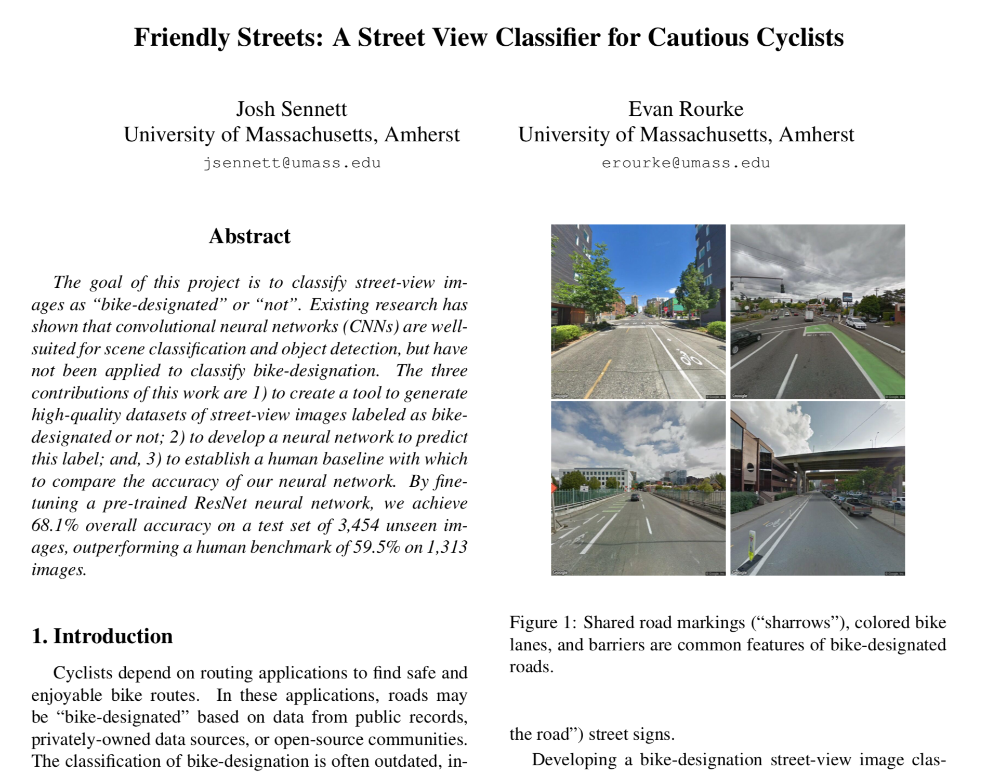

# Bike-Designated Street View Image Classifier
In this project, [Evan](https://github.com/RAWRke) and I used OpenStreetMap and Google StreetView API to generate an extensive dataset of 17,270 oriented images of streets, labeled as bike-designated or not. Then, we trained a neural network to classify images. Our neural network outperformed human efforts (other students), correctly classifying 68% of 3454 unseen images (compared to human-accuracy of 58%).

Please contact me if you would like to use our dataset. Or, modify the `scripts/download_osm.py` and `scripts/download_streetview.py` to generate your own labeled images. You wil need a Google Maps API key and some credits if you plan to generate a lot of images. 

See more on our methodology and results in the [full writeup](writeup/writeup.pdf).

<kbd>
 
</kbd>

Or, check out our [poster presentation](writeup/poster.png)! 

<kbd>
 
</kbd>

